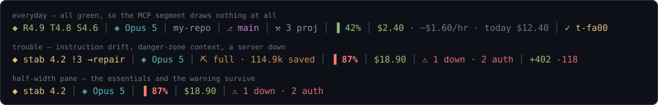

# claude-statusline

[](https://github.com/decebal/claude-statusline/actions/workflows/ci.yml)
[](./LICENSE)
[](https://www.rust-lang.org/)
[](https://code.claude.com/docs/en/statusline)

**claude-statusline is a fast, dependency-light Rust status line for [Claude Code](https://code.claude.com/docs/en/statusline).** It turns the JSON that Claude Code streams on stdin into a single powerline row showing your model, git branch, color-coded context-window usage, live spend (session cost, per-hour burn rate, today's total across every session), and an optional multi-dimensional **[agent-health](#agent-health-score)** readout — and it **never blanks, hangs, or panics**, whatever the session sends it.



> The real status line prefixes each segment with a [Nerd Font](https://www.nerdfonts.com/) powerline glyph. Terminals without a Nerd Font (and GitHub itself) can't render those glyphs, so set `CLAUDE_STATUSLINE_ASCII=1` for the plain-text form:

```text
model Opus 4.8 | dir my-repo | git main | ctx 42% | cost $2.40 · ~$1.60/hr · today $12.40 | task t-fa00 | rate 5h 24% · 7d 41% | lines +156 -23
```

## What it does

claude-statusline renders up to ten segments in one line, each drawn only when its data is present. Context usage is color-coded green → yellow → **bold red** as you approach the limit, so the "danger zone" is visible at a glance.

- **Agent health** *(optional, first segment)* — a multi-dimensional readout (rule-adherence · truthfulness · task-success · stability) with a green/yellow/red verdict, instead of one vague "quality" number. Only shows when a health state file exists. See [Agent health score](#agent-health-score).
- **Model** — the active model's display name.
- **Caveman mode** *(optional)* — the active [caveman](https://github.com/JuliusBrussee/caveman) compression level and the tokens it has saved. Only shows when caveman is active. See [Caveman mode](#caveman-mode).
- **Repo / dir** — repository name, else the working-directory basename.
- **Git branch** — read straight from `.git/HEAD` with **no `git` subprocess**; handles worktrees and detached HEAD.
- **Context %** — green `<50`, yellow `50–80`, **bold red `>80`** or when `exceeds_200k_tokens` trips.
- **Cost cluster** — `session · ~$/hr burn · today's total` (see below).
- **Task** — the in-progress [chronis](https://github.com/rtk-ai) (`cn`) task in the current directory. Optional; omitted if `cn` or a task isn't found.
- **Rate limit** — 5-hour and 7-day usage windows (shown on Pro/Max plans).
- **Lines ±** — lines added/removed this session.

## Quick start

Install the binary, then point Claude Code at it. That's the whole setup.

```sh
cargo install --git https://github.com/decebal/claude-statusline
```

Add this to `~/.claude/settings.json` (global — applies to every project):

```json
{
  "statusLine": {
    "type": "command",
    "command": "claude-statusline"
  }
}
```

Use an absolute path (e.g. `~/.cargo/bin/claude-statusline`) if `~/.cargo/bin` isn't on the status line's `PATH`. The status line refreshes on Claude Code's own events; add `"refreshInterval": 5` to the block if you want it to also tick while idle.

## Cost, burn rate, and today's spend

The cost cluster answers "what is this session costing me, and how much have I spent today?" in one place. Session cost and the per-hour burn rate come directly from Claude Code's stdin JSON; today's total is computed the way [ccusage](https://ccusage.com/guide/statusline) does it.

Claude Code transcripts record `costUSD: null` on every line, so **today's total is derived, not read**: claude-statusline sums today's token `usage` across `~/.claude/projects/**/*.jsonl` and multiplies by a per-model price table. Prices are per-million tokens (August 2026); cache rates follow Anthropic's published ratios — cache read `0.10×` input, 5-minute cache write `1.25×`, 1-hour cache write `2.0×`.

**Override the built-in prices without recompiling** by creating `~/.claude/statusline-pricing.json`:

```json
{
  "claude-opus-4-8":   { "input": 5.0, "output": 25.0 },
  "claude-sonnet-4-6": { "input": 3.0, "output": 15.0 }
}
```

## Agent health score

An optional first segment shows a compact, multi-dimensional **agent health**
readout instead of one vague "quality" number — so you can tell instruction
drift from hallucination from execution failure at a glance:

```
 R4.8 T4.7 S4.6          healthy   (green)
 stab 4.2 !3 →repair     degraded  (yellow — a live tool-failure loop)
 R– T4.4 S– →restart     restart   (red — hard gate)
```

R = rule adherence · T = truthfulness · S = task success · `!N` = drift ·
`→next` = recommended action. Colour is the verdict (green/yellow/red).

**It only displays; it never invents scores.** The status line reads a
per-session state file (`~/.claude/agent-health/<session_id>.json`), filled by
two bundled hooks:

| Binary | Hook | Fills |
|---|---|---|
| `claude-health-hook` | `PostToolUse` + `PostToolUseFailure` | stability + drift, from real tool outcomes |
| `claude-health-report` | `Stop` | rules / truth / task, from a cheap judge model |

Anything a hook hasn't scored renders `–`, never a guess: the report omits a
dimension the transcript can't support, and an unfinished turn scores no `task`
rather than a bad one. Any safety/critical flag is a **hard gate** that forces
red regardless of the averages.

The report costs roughly **$0.02 per turn** (one `haiku` call), never blocks the
turn — it detaches and grades in the background — and cannot recurse into itself.
Skip it and the segment still works, with the subjective three showing `–`.

Full schema, thresholds, restart policy, prompt design, and settings snippets:
[docs/agent-health.md](docs/agent-health.md).

## Caveman mode

[caveman](https://github.com/JuliusBrussee/caveman) compresses assistant prose to
cut token spend, and ships a badge script for the status line. Running it meant
choosing between that badge and this status line, so claude-statusline renders
the badge itself — no `bash`, no `node`, no wrapper:

```text
model Opus 4.8 | ⛏ full · 114.9k saved | dir my-repo | git main | ctx 42% | cost $2.40
```

It reads the two files the plugin already writes under `$CLAUDE_CONFIG_DIR`
(default `~/.claude`) — `.caveman-active` for the level, and
`.caveman-statusline-suffix` for the savings figure `/caveman-stats` renders.
Both are absent for everyone not running caveman, so the segment costs two
`stat` calls and draws nothing.

The savings figure only appears once `/caveman-stats` has run at least once —
until then the badge is the level alone, never an invented number. The level
`off` draws nothing: "not compressing" is not news.

Both files are treated as hostile input, because their paths are predictable and
a local attacker could plant one: a symlink is refused, the read is capped at 64
bytes, the level must be on caveman's own whitelist, and the savings figure must
parse as a whole token count (`114.9k`, `1.2M`) — so a planted
`\x1b[31mPWNED\x1b[0m` renders nothing rather than repainting the terminal on
every keystroke. Hide the segment with `CLAUDE_STATUSLINE_NO_CAVEMAN=1`.

## Configuration

Every knob is an environment variable, so it composes cleanly with the `command` string.

| Variable | Effect |
|---|---|
| `CLAUDE_STATUSLINE_ASCII=1` (or `NERD_FONT=0`) | Plain-text labels instead of Nerd-Font glyphs (colors kept) |
| `CLAUDE_STATUSLINE_NO_DAILY=1` | Skip the transcript scan (drops the `today $…` figure) |
| `CLAUDE_STATUSLINE_NO_HEALTH=1` | Hide the agent-health segment |
| `CLAUDE_STATUSLINE_HEALTH_DIR=<path>` | Override the health state-file dir |
| `CLAUDE_STATUSLINE_NO_CAVEMAN=1` | Hide the caveman-mode segment |
| `CLAUDE_CONFIG_DIR=<path>` | Where the caveman flag files are read from (default `~/.claude`) |
| `CLAUDE_STATUSLINE_CN_TTL=<secs>` | Chronis task cache TTL (default `8`) |
| `CLAUDE_STATUSLINE_CN_BIN=<path>` | Explicit path to the `cn` binary |

## Why it's safe to run on every keystroke

A status line command runs constantly, so claude-statusline is built to be boring under load: fast, bounded, and impossible to break.

- **Never blank / never panics.** Any stdin — empty, truncated, non-JSON, wrong-typed — still prints one non-empty line and exits `0`. (Claude Code blanks the status line on empty stdout or a non-zero exit, so this is a hard guarantee, verified across ~40 malformed and hostile inputs.)
- **Never hangs.** The `cn` lookup is wall-clock bounded to **≤ 800 ms** and cached per directory; the daily-cost scan is cached for **60 s** and only reads files modified today. Warm renders are **single-digit milliseconds**.
- **Tiny.** **Two** dependencies (`serde`, `serde_json`); a **~470 KB** stripped release binary. No `git`, `jq`, or shell subprocesses on the hot path.

## Narrow and split-screen terminals

claude-statusline adapts to the width Claude Code reports in `COLUMNS`. When space runs out it degrades gracefully — dropping the lowest-value segments first, then compacting the cost cluster — so **model, context %, and cost never fall off screen** on a half-width pane.

Removal order: `lines±` → `rate limit` → cost `burn`/`today` extras → `repo` → `git branch` → `task`. The three essentials are never dropped.

| Terminal width | What stays |
|---|---|
| Full | all eight segments |
| Wide split | drops lines±, then rate limit |
| ~Half | cost compacts to session-only; drops repo + branch |
| Very narrow | model · context % · cost |

`COLUMNS` is exported by Claude Code v2.1.153+. If it's unset, the line renders in full (no truncation).

## How it compares

claude-statusline optimizes for a lean, native, never-blank single binary with built-in cost math and chronis task tracking. Other excellent status lines trade that for more widgets or a config UI — pick what fits.

| Project | Runtime | Focus |
|---|---|---|
| **claude-statusline** (this) | Rust (single binary) | Speed, never-blank guarantee, cost + burn + daily, chronis tasks, **agent-health readout**, caveman badge |
| [ccstatusline](https://github.com/sirmalloc/ccstatusline) | TypeScript / Bun | Many widgets + TUI configurator |
| [claude-powerline](https://github.com/chongdashu/claude-powerline) | Node | Plugin-native powerline themes |
| [CCometixLine](https://github.com/Haleclipse/CCometixLine) | Rust | Powerline segments |
| [ccusage](https://ccusage.com/guide/statusline) | Node | Cost/usage analytics (statusline mode) |

## FAQ

### Does it work without a Nerd Font?
Yes. Set `CLAUDE_STATUSLINE_ASCII=1` (or `NERD_FONT=0`) and it renders plain-text labels (`model`, `ctx`, `cost`, …) with colors intact. The powerline glyphs need a [Nerd Font](https://www.nerdfonts.com/) such as *MesloLGS NF*; without one they show as boxes, which is why the ASCII fallback exists.

### How does it calculate today's cost?
It sums today's token usage from your Claude Code transcripts (`~/.claude/projects/**/*.jsonl`) and applies a per-model price table, because transcripts store `costUSD: null`. Cache tokens are priced at Anthropic's ratios (read `0.10×`, write `1.25×`/`2.0×`). Disable the scan with `CLAUDE_STATUSLINE_NO_DAILY=1`.

### Will it slow down Claude Code?
No. Warm renders are single-digit milliseconds; the only external call (`cn`) is capped at 800 ms and cached, and the daily scan is cached for 60 seconds. There are no `git`/`jq`/shell subprocesses on the hot path.

### Does it require chronis?
No. The task segment simply disappears if `cn` (chronis) or an in-progress task isn't found. Every other segment works standalone.

### What happens if Claude Code sends malformed data?
It still prints a valid one-line status and exits `0`. A missing or null field omits only its own segment; garbage input falls back to the model name. This is a design guarantee, not a best effort.

### Is the pricing table going to go stale?
The built-in prices are a snapshot (August 2026). When Anthropic changes prices, edit the table or drop a `~/.claude/statusline-pricing.json` override — no recompile needed.

### Do I have to drop caveman's badge script to use this?
No — this renders it. Point `statusLine.command` at claude-statusline and the caveman level plus its savings figure appear as a segment, read from the same files the plugin already writes. Nothing to install, nothing to wrap, and `CLAUDE_STATUSLINE_NO_CAVEMAN=1` turns it off. See [Caveman mode](#caveman-mode).

### What happens on a small or split-screen terminal?
It adapts to `COLUMNS` and drops the least-important segments first (the caveman badge, then lines±, then rate limit, then cost extras, then repo/branch/task), always keeping model, context %, and cost. So on a half-width pane you still see how full your context is and what the session costs.

### What is the agent-health segment?
An optional first segment reporting how the agent is doing across *separate* dimensions — rule-adherence, truthfulness, task-success, stability — with a green/yellow/red verdict, so you can tell instruction drift from hallucination from execution failure at a glance (not one vague "quality" number). It **only displays** scores from a per-session state file and **never invents them**: the bundled `claude-health-hook` fills the observable dimensions (stability + drift) from real tool outcomes; the rest render `–` until an evaluator or the agent writes them. Any safety/critical flag is a hard gate → red. Full schema, rubric, and hook wiring: [docs/agent-health.md](docs/agent-health.md).

## Contributing

Issues and PRs welcome. `cargo fmt`, `cargo clippy --all-targets -- -D warnings`, and `cargo build --release` should all be clean.

## License

MIT © decebal
